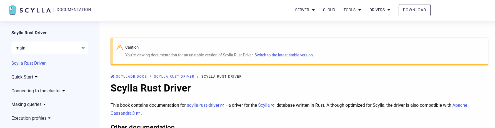
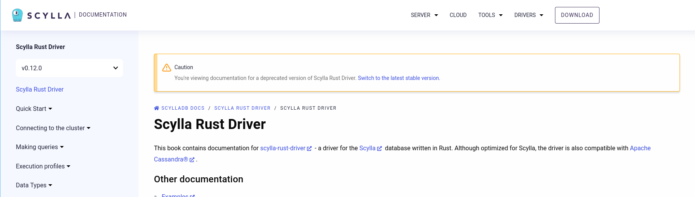
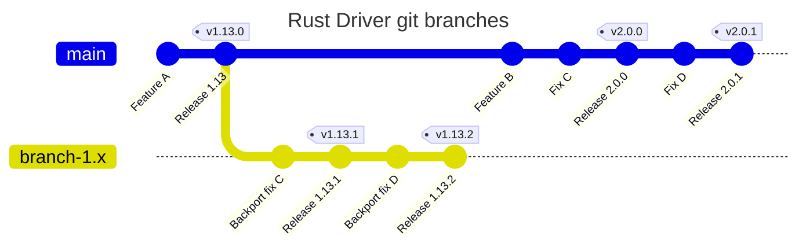

# Maintenance

The following document includes information how to release scylla-rust-driver and
other information / procedures useful for maintainers. It is quite long, but it's
mostly because it describes a lot of details and reasoning, not because it is
complicated.

## Crates and versions

This workspace consists of 4 crates:
- `scylla`: main driver crate to be used by users;
  the only one expected to be added as a dependency and have items imported from (i.e. the only "public" crate).
  Depends on `scylla-cql`.
- `scylla-macros`: provides derive macros for users to be able to use their structs as UDTs / query parameters.
- `scylla-cql`: low-level implementation of CQL binary protocol. Depends on `scylla-macros`.
- `scylla-proxy`: mostly internal crate that aids testing. Depends on `scylla-cql`.

We publish all 4 crates on [crates.io](https://crates.io/crates/scylla).

Versions of the crates are decided with strict accordance to semver.
For sources on semver and semver in rust see:
- https://doc.rust-lang.org/cargo/reference/resolver.html
- https://doc.rust-lang.org/cargo/reference/semver.html
- https://semver.org/
- https://rust-lang.github.io/api-guidelines/necessities.html#public-dependencies-of-a-stable-crate-are-stable-c-stable (and some other parts of this book).

What needs to be considered for releasing:
- Versions of `scylla-cql` and `scylla-macros` MUST always be the same. `scylla-cql` MUST depend on EXACT version of `scylla-macros` (e.g. `version = "=1.0.0"` in `Cargo.toml`). This ensures that we can change the `_macro_internal` module in minor releases, and generally simplifies reasoning about those 2 crates. If Rust allowed it, they would be one crate.
- For simplicity of maintenance, and to avoid potential problems with mixed versioning, we decided to always release all 3 crates together, with the same version numbers. Important: it does not allow us to make breaking changes in `scylla-cql`! Older versions of `scylla` will pick up newer versions of `scylla-cql`, e.g. after we release `scylla-cql 1.2`, `scylla 1.0` may start using it.

### `scylla-cql` API considerations

`scylla-cql` is purposefully available on [crates.io](https://crates.io/). This is mainly because some other crates, including ours (e.g., https://github.com/scylladb/scylla-rust-udf), use `scylla-cql` only and we don't want force them to pay in needless overhead introduced by depending on the whole `scylla` crate.
As `scylla-cql` is publicly available, it must comply to semver.

`scylla-cql` has some `pub` APIs that are not `pub`-re-exported in `scylla`. One might think this allows us bumping `scylla-cql` major number while  bumping only minor number of `scylla` **if only** the breaking changes introduced in `scylla-cql` aren't visible in `scylla` API. **This is, unfortunately, not true!** The following bad scenario is a possible result of such action:

Imagine if some crate `X` has both `scylla = "1.x"` and `scylla-cql = "1.x"` in dependencies, which is legal. It's even more likely if we take into account dependency transitivity, so the whole dependency tree must be considered. `X` can then use `scylla_cql` paths to operate on items that come from it, instead of using `scylla` re-exports. This is also legal.
If we now update `scylla` to `1.(x+1)`, and use `scylla-cql = 2.0` there (in `scylla 1.(x+1)`), then the user will suddenly get errors about incompatible types (because they come from different major versions of the crate).

To illustrate on a specific case, consider the following definition present in `X`:
`impl scylla_cql::serialize::row::SerializeRow for SomeStructDefinedInX { ... }`
Now, even if we introduced no breaking changes to `SerializeRow` between `scylla-cql` 1.0 and 2.0, we end up with two different trait named `SerializeRow`, so the compiler refuses to accept (pseudonotation) `scylla-cql<1.x>::SerializeRow` as `scylla-cql<2.0>::SerializeRow`.

Does this mean that we are stuck with the current (sadly, still far from perfect) `scylla-cql` API for the whole `scylla = 1.x`? **Fortunately, no!** Imagine we are dissatisfied with the API of a struct `A` defined in `scylla-cql`:
```rust
pub struct A {
  pub field: Typ,
}
```
Assuming `A` is **not** part of `scylla`'s public API (it does not matter if it's re-exported there or not), we can:
1. introduce `A2` in `scylla-cql`, which has a better new API compared to `A` - this is a non-breaking change, because it's adding something new to the API;
2. alter `scylla` code to use `A2` instead of `A` - this is non-breaking, because we've assumed `A` is not present in any `scylla` public API;
3. keep `A` in `scylla-cql`, as well as possible `A` re-exports in `scylla`. Even though it's now legacy, it doesn't hurt. If suitable, we can mark `A` as `#[deprecated]` and remove it in the next major release.

## Documentation

There are 2 places where documentation is published:
- [docs.rs](https://docs.rs/scylla/latest/scylla/): API docs, generated automatically when publishing a crate to [crates.io](https://crates.io/crates/scylla).
- [Documentation book](https://rust-driver.docs.scylladb.com/stable/): generated and published by our CI (see [docs-pages.yaml](https://github.com/scylladb/scylla-rust-driver/blob/main/.github/workflows/docs-pages.yaml)) when there is a push to either `main` or to some `v*.*.*` tag.

Parameters relevant to releasing documentation book are configured in `docs/source/conf.py` and `docs/pyproject.toml` files.
In `pyproject.toml` there is the `version` field - we do update it but I don't think it affects anything.
In `docs/conf.py` there are `TAGS`, `BRANCHES`, `LATEST_VERSION`, `UNSTABLE_VERSIONS` and `DEPRECATED_VERSIONS` fields.

`TAGS` and `BRANCHES` are lists of tags and branches for which documentation book will be built - those 2 lists add up to a list of versions you see when you click (expand) a version list in the left upper corner of [documentation book](https://rust-driver.docs.scylladb.com/stable/).

`LATEST_VERSION` selects the element from the above list that will be the default ("stable") version shown when visiting https://rust-driver.docs.scylladb.com/stable/index.html.

`UNSTABLE_VERSIONS` is a subset of `TAGS + BRANCHES`. If a version is on this list it will have a note in rendered documentation informing about instability:



`DEPRECATED_VERSIONS` is a subset of `TAGS + BRANCHES`. If a version is on that list then it will have a similar note informing about deprecation:



IMPORTANT: `docs/source/conf.py` for rendering documentation is always taken from the `main` branch - even if a push to `branch-*` triggered the job.
If that was not the case we would have to always synchronize `conf.py` on all supported branches - right now we only need to have it correct on `main` branch.

It however means that **any release requires updating `conf.py` on `main` branch** to have the new version rendered on documentation book.

## Branches and tags

Historically (before 1.0) we created a branch per major release, called e.g. `branch-0.14.x`. Those branches were used when we wanted to make a bugfix release (e.g. 0.14.1) after a new major (e.g. 0.15) was already released.
In this case we backported all necessary PRs onto such branch, and we made the release there.

After 1.x this became mostly unnecessary, and we won't create any branches unless a situation happens that requires as to. Why?
- Minor updates of the driver can be applied fearlessly, so we do not expect to have to make patches for older minor releases. If for some reason we have to release such a bugfix for older minor, we can then create a branch at its tag (e.g. create `branch-1.1.x` at tag `v.1.1.2`).
- Such branches are an additional burden.

We may create a branch for a major version when we start to really work on the next one. For example, we may create `branch-1.x` so that we can keep releasing `1.x` versions while making breaking changes related to 2.0 on `main`. This is still to be decided in the future.

All new development lands on `main` branch, and may be backported by maintainers to version branches.

Each release of `scylla` crate has a corresponding git tag. Tags are named `vX.Y.Z`, so release `1.2.3` will have tag `v1.2.3`.
Each such tag has a message of the form `Release X.Y.Z` (e.g. `Release 1.2.3`).

Below is a simplified view of how this looks.
Diagrams created using [mermaid.js](https://mermaid.js.org/). If you view this file on GitHub it should be rendered correctly.
You can also view it using [mermaid.live](https://mermaid.live)



## Version bump commits

For simplicity the graph in previous section suggested that version bumps happen in one commit.
In reality we bump each crate version in a separate commit.

For an example, see four last commits of this PR: https://github.com/scylladb/scylla-rust-driver/pull/1040/commits

Commits that update `scylla-proxy` / `scylla-macros` / `scylla-cql` change:
- `version` field in relevant `Cargo.toml`
- Version number in crates that depend on given crate (so a commit bumping `scylla-macros` will also change version of
`scylla-macros` in `scylla` and `scylla-cql` crates).
- Version number of the crate in `Cargo.lock.msrv`

Additionally the last commit (which bumps `scylla` crate version) changes:
- `docs/pyproject.toml` and `docs/source/conf.py`, as described in "Documentation" section.
- Version number in `docs/source/quickstart/create-project.md`.

## Backporting

We perform backports using cherry-picks.

Please always use `-x` flag for cherry-pick to record information about original commit.
It will add to the bottom of the commit message a line like `(cherry picked from commit 5752af488655287fc332ec3dd68645ef522e0d7c)`

If you want to backport a whole PR, you should cherry-pick the merge commit.
You will need `-m` flag for that - it selects which is the "main" parent.
Typically you will use "-m 1", because first parent is the main one (think `main` branch),
and second one is PR branch.

That means the typical command to backport whole PR is `git cherry-pick -x -m 1 commit-sha`.

You can also backport a single commit - which can be part of a PR branch or not, doesn't matter.
In this case you don't need `-m` flag, you can just do `git cherry-pick -x commit-sha`.

## Releasing

IMPORTANT: Read this whole document before attempting to do a release.

Prerequisites:
- Have write access to GitHub repo (so that you are able to push to main and create a new branch).
- Have access to our crates on [crates.io](https://crates.io).
- Decide what the new version should be. Take into consideration that we want to keep versions of all 3 main crates (`scylla-macros`, `scylla-cql`, `scylla`) in sync.


### Releasing a new version

1. Checkout `main`.
2. Create some new branch (which you'll later push to your fork).
3. Create commits that bump version numbers of the crates (see `Version bump commits` section in this document).
4. Prepare release notes (see the template at the bottom of this document).
5. (Optional, but recommended) Push the branch to your fork and create the PR to `main` so that another maintainer can review your work.
Description of this PR should consist of just release notes. **NOTE: Preferably merge this PR with CLI as described in next step. If you really want to use GitHub UI only use REBASE merge.** This is to make all commits appear on the version branch, without any merge commits / squash commits.
6. Checkout `main` and fast-forward merge your changes (`git merge --ff-only your_branch`).
7. Create a new tag (e.g. `git tag -a v1.2.0 -m "Release 1.2.0"`).
8. Push `main` and the new tag, preferably using atomic push (e.g. `git push --atomic origin main v1.2.0`).
9. Create a new commit on `main` that updates documentation version - see "Documentation" section in this document. This should build book documentation and publish it on [Documentation book](https://rust-driver.docs.scylladb.com/stable/).
10. Verify that documentation book was published at [Documentation book](https://rust-driver.docs.scylladb.com/stable/).
11. Publish all updated crates to crates.io. Make sure you are using newest stable version of Rust. In the main folder of the repository run `cargo publish -p <crate>` for each crate that is being updated, in correct order (`scylla-macros`, `scylla-cql`, `scylla-proxy`, `scylla`).
12. Verify that new versions are visible on crates.io and their docs on docs.rs.
13. Go to https://github.com/scylladb/scylla-rust-driver/releases , click the `Draft new release` button and follow the procedure to create a new release on GitHub. Use the release notes as its description.
14. (Mandatory for major / minor release, optional for patch release) Publish a post on the forum:
    - Go to [Release notes](https://forum.scylladb.com/c/scylladb-release-notes/18) section.
    - Click "New Topic".
    - Title should be `[RELEASE] ScyllaDB Rust Driver <version>`, e.g. `[RELEASE] ScyllaDB Rust Driver 1.2.0`
    - Tags: `release`, `drivers`, `rust-driver`, `rust`, `driver-release`.
    - Content of the post should just be release notes.
    - Click "Create Topic"
    - Posts in "Release notes" section often need additional confirmation. You can write to current forum admin to expedite this.

You're done!

### Releasing a minor / patch version for an old major

This is for releasing e.g. 1.13.2 after 2.0 is released.
Steps are the same as for releasing a normal version.
The difference is that instead of `main` you need to use a version branch, which you may need to create (e.g. `branch-1.x`).
Backport the necessary changes to this branch before making version bump commits.
Please note that in step 9 you still need to use `main`, as described in the section about documentation.


## Writing release notes

PR titles are written for maintainers, but release notes entries are written for users.
It means that they should not be the same - and if they are then they are probably
not good as either PR titles or release notes entries.

For that reason we hand-write our release notes, and link to relevant PRs in the entries.

Some old release notes that you can take inspiration from when writing new ones:
- https://github.com/scylladb/scylla-rust-driver/releases/tag/v1.0.0
- https://github.com/scylladb/scylla-rust-driver/releases/tag/v0.10.0
- https://github.com/scylladb/scylla-rust-driver/releases/tag/v0.14.0
- https://github.com/scylladb/scylla-rust-driver/releases/tag/v0.11.0
- https://github.com/scylladb/scylla-rust-driver/releases/tag/v0.13.0

The template for release notes can be found in the section below.

Guidelines on how to write release notes:

- Go over all the PRs / commits since previous release. Usually: `git log --first-parent` to see
  merge commits and commits that are directly on a branch. You can also try filtering
  merged PRs on GitHub by merge date, but it's cumbersome. Since 1.0 we try to assign each merged PR to a milestone,
  which should make this process much easier - you can just go over e.g. https://github.com/scylladb/scylla-rust-driver/milestone/18?closed=1

- Items in release notes will usually correspond 1:1 to PRs / commits - but not always. It is possible that
  some functionality that should be a single item on the list is split over multiple PRs.
  It is also possible that single PR will be mentioned in two items.

- Release notes should contain all items since previous (in terms of semver) version released at the time. Items that were backported will be
  duplicated between release notes for at least 2 different versions that way. This is fine, the backport should just be marked as such in release notes.

- Release notes should contain a table with the number of non-backported commits per contributor.
  Depending on the situation you may generate it with `git shortlog --no-merges $(git merge-base main previous_version_tag)..HEAD -s -n` and manually subtracting
  backported commits, or just `git shortlog --no-merges previous_version_tag..HEAD -s -n` .
  If it is too much work, or you can't figure out how to calculate it in particular situation, you can skip it.
  This table should not count version bump commits - subtract them from your
  row if you already created them.

- Remember to update the amount of crate downloads and GitHub stars!


## Release notes template

PR numbers in the list are random, they are just here to emphasize that entries
should contain links to relevant PR / PRs.

```
The ScyllaDB team is pleased to announce ScyllaDB Rust Driver X.Y.Z,
an asynchronous CQL driver for Rust, optimized for ScyllaDB, but also compatible with Apache Cassandra!

Some interesting statistics:

- over 2.103k downloads on crates!
- over 556 GitHub stars!

## Changes

**New features / enhancements:**
- Some new feature 1 ([123](https://github.com/scylladb/scylla-rust-driver/pull/123))
- Some new feature 2 ([123](https://github.com/scylladb/scylla-rust-driver/pull/123))

**Bug fixes:**
- Some bugfix 1 ([123](https://github.com/scylladb/scylla-rust-driver/pull/123))
- Some bugfix 2 ([123](https://github.com/scylladb/scylla-rust-driver/pull/123))

**Documentation:**
- Doc update 1 ([123](https://github.com/scylladb/scylla-rust-driver/pull/123))
- Doc update 2 ([123](https://github.com/scylladb/scylla-rust-driver/pull/123))

**CI / developer tool improvements:**
- Update 1 ([123](https://github.com/scylladb/scylla-rust-driver/pull/123))
- Update 2 ([123](https://github.com/scylladb/scylla-rust-driver/pull/123))

**Others:**
- Update 1 ([123](https://github.com/scylladb/scylla-rust-driver/pull/123))
- Update 2 ([123](https://github.com/scylladb/scylla-rust-driver/pull/123))

Congrats to all contributors and thanks everyone for using our driver!

----------

The source code of the driver can be found here:
- [https://github.com/scylladb/scylla-rust-driver](https://github.com/scylladb/scylla-rust-driver)
Contributions are most welcome!

The official crates.io registry entry is here:
- [https://crates.io/crates/scylla](https://crates.io/crates/scylla)

Thank you for your attention, please do not hesitate to contact us if you have any questions, issues, feature requests, or are simply interested in our driver!

Contributors since the last release:

| commits | author            |
|---------|-------------------|
| 45      | Lucille Perkins   |
| 34      | Rachel Burton     |
| 17      | Mercedes Marks    |

```
