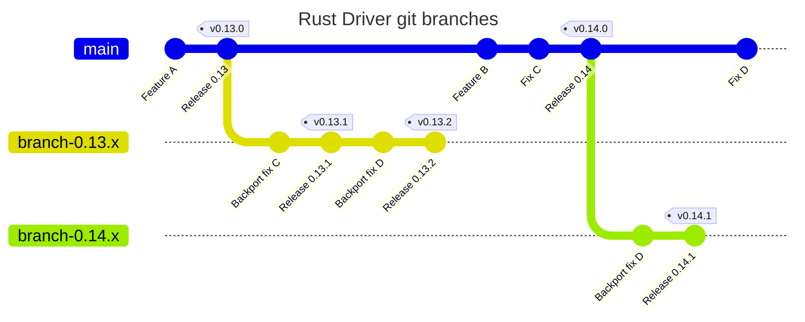

# Maintenance

The following document includes information how to release scylla-rust-driver and
other information / procedures useful for maintainers.

## Crates and versions

This workspace consists of 4 crates:
- `scylla`: main driver crate to be used by users;
  the only one expected to be added as a dependency and have items imported from (i.e. the only "public" crate).
  Depends on `scylla-cql` and `scylla-macros`.
- `scylla-macros`: provides derive macros for users to be able to use their structs as UDTs / query parameters.
- `scylla-cql`: low-level implementation of CQL binary protocol. Depends on `scylla-macros`.
- `scylla-proxy`: mostly internal crate that aids testing. Depends on `scylla-cql`.

We publish all 4 crates on [crates.io](https://crates.io/crates/scylla).

Versions of the crates are decided with strict accordance to semver.
For sources on semver and semver in rust see:
- https://doc.rust-lang.org/cargo/reference/resolver.html
- https://doc.rust-lang.org/cargo/reference/semver.html
- https://semver.org/
- https://rust-lang.github.io/api-guidelines/necessities.html#public-dependencies-of-a-stable-crate-are-stable-c-stable (and some other parts of this book).

What needs to be considered for releasing:
- You mustn't change major version of scylla-cql / scylla-macros dependency in a minor update of scylla crate.
For example, if scylla 0.13.0 depends on scylla-cql 0.4, then scylla 0.13.1 mustn't depend on scylla-cql 0.5.
- We typically bump major versions of all 3 main crates (`scylla`, `scylla-cql`, `scylla-macros`) together. I'm not sure if it's necessary - I remember there were
arguments for that, but I can't remember them.


## Documentation

There are 2 places where documentation is published:
- [docs.rs](https://docs.rs/scylla/latest/scylla/): API docs, generated automatically when publishing a crate to [crates.io](https://crates.io/crates/scylla).
- [Documentation book](https://rust-driver.docs.scylladb.com/stable/): generated and published by our CI (see [docs-pages.yaml](https://github.com/scylladb/scylla-rust-driver/blob/main/.github/workflows/docs-pages.yaml)) when there is a push to either `main` or to some `v0.*` tag.

Parameters relevant to releasing documentation book are configured in `docs/source/conf.py` and `docs/pyproject.toml` files.
In `pyproject.toml` there is the `version` field - we do update it but I don't think it affects anything.
In `docs/conf.py` there are `TAGS`, `BRANCHES`, `LATEST_VERSION`, `UNSTABLE_VERSIONS` and `DEPRECATED_VERSIONS` fields.

`TAGS` and `BRANCHES` are lists of tags and branches for which documentation book will be built - those 2 lists add up to a list of versions you see when you click "expand" a version list in the left upper corner of [documentation book](https://rust-driver.docs.scylladb.com/stable/).

`LATEST_VERSION` selects the element from the above list that will be the default ("stable") version shown when visiting https://rust-driver.docs.scylladb.com/stable/index.html.

`UNSTABLE_VERSIONS` is a subset of `TAGS + BRANCHES`. If a version is on this list it will have a note in rendered documentation informing about instability:


`DEPRECATED_VERSIONS` is a subset of `TAGS + BRANCHES`. If a version is on that list then it will have a similar note informing about deprecation:


IMPORTANT: `docs/source/conf.py` for rendering documentation is always taken from the `main` branch - even if a push to `branch-*` triggered the job.
If that was not the case we would have to always synchronize `conf.py` on all supported branches - right now we only need to have it correct on `main` branch.

It however means that **any release requires updating `conf.py` on `main` branch** to have the new version rendered on documentation book.

## Branches and tags

We maintain a branch per major release (after releasing 1.0 we may change to a branch per minor release - this is yet to be decided). This is done so that we are able to release an update for older major release (e.g. release 0.13.3 after 0.14.0 is released).
Major version branches are named `branch-0.A.x`, where `A` is a number of the version. Example: branch for `0.14` will be `branch-0.14.x`.

All new development lands on `main` branch, and may be backported by maintainers to version branches.

Each release of `scylla` crate has a corresponding git tag. Tags are named `vA.B.C`, so release `0.14.1` will have tag `v0.14.1`.
Each such tag has a message of the form `Release 0.X.Y` (e.g. `Release 0.14.0`).

Below is a simplified view of how this looks.
Diagrams created using [mermaid.js](https://mermaid.js.org/). If you view this file on GitHub it should be rendered correctly.
You can also view it using [mermaid.live](https://mermaid.live)



## Version bump commits

For simplicity the graph in previous section suggested that version bumps happen in one commit.
In reality we bump each crate version in a separate commit.

For an example, see four last commits of this PR: https://github.com/scylladb/scylla-rust-driver/pull/1040/commits

Commits that update `scylla-proxy` / `scylla-macros` / `scylla-cql` change:
- `version` field in relevant `Cargo.toml`
- Version number in crates that depend on given crate (so a commit bumping `scylla-macros` will also change version of 
`scylla-macros` in `scylla` and `scylla-cql` crates).
- Version number of the crate in `Cargo.lock.msrv`

Additionally the last commit (which bumps `scylla` crate version) changes:
- `docs/pyproject.toml` and `docs/source/conf.py`, as described in "Documentation" section.
- Version number in `docs/source/quickstart/create-project.md`.

## Backporting

We perform backports using cherry-picks.

Please always use `-x` flag for cherry-pick to record information about original commit.
It will add to the bottom of the commit message a line like `(cherry picked from commit 5752af488655287fc332ec3dd68645ef522e0d7c)`

If you want to backport a whole PR, you should cherry-pick the merge commit.
You will need `-m` flag for that - it selects which is the "main" parent.
Typically you will use "-m 1", because first parent is the main one (think `main` branch),
and second one is PR branch.

That means the typical command to backport whole PR is `git cherry-pick -x -m 1 commit-sha`.

You can also backport a single commit - which can be part of a PR branch or not, doesn't matter.
In this case you don't need `-m` flag, you can just do `git cherry-pick -x commit-sha`.

## Releasing

IMPORTANT: Read this whole document before attempting to do a release.

Prerequisites:
- Have write access to GitHub repo (so that you are able to push to main and create a new branch).
- Have access to our crates on [crates.io](https://crates.io).
- For each of our 3 crates in this workspace (`scylla-macros`, `scylla-cql`, `scylla`) decide if it needs a new version, and if so, what is the correct version number. See "Crates and versions" section.

### Releasing a major version

1. Check out current `main`, e.g. `git fetch; git checkout origin/main`.
2. Create a new version branch, e.g. `git checkout -b "branch-0.14.x"`.
3. Create commits that bump version numbers of the crates (see `Version bump commits` section in this document).
4. Push the new branch to our repo (e.g. `git push origin branch-0.14.x`).
5. Prepare release notes (see the template at the bottom of this document).
6. (Optional, but recommended) Create a PR from the new branch to `main` so that another maintainer can review your work.
Description of this PR should consist of just release notes. **NOTE: Don't merge this PR using GitHub interface - just wait for approval.** The reason is that we want `main` and `branch-XX` to point to the same commit after merge, but Github doesn't have fast-forward merges in GUI - it will however detect such merge done in Git CLI and mark the PR as merged.
7. Checkout `main` and fast-forward merge the new branch (e.g. `git checkout main; git merge --ff-only branch-0.14.x`).
6. Create a new tag (e.g. `git tag -a v0.14.0 -m "Release 0.14.0"`).
9. Push `main` and new tag, preferably using atomic push (e.g. `git push --atomic origin main v0.14.0`). This should build book documentation and publish it on [Documentation book](https://rust-driver.docs.scylladb.com/stable/).
10. Go to the "Common steps" section below.

### Releasing a minor version

1. Checkout the correct version branch (e.g. `git checkout "branch-0.14.x"`).
2. Create some new branch (which you'll later push to your fork).
3. Perform any backports that are missing from the release.
3. Create commits that bump version numbers of the crates (see `Version bump commits` section in this document).
4. (Optional, but recommended) Push the branch to your fork and create the PR to the version branch so that another maintainer can review your work.
Description of this PR should consist of just release notes. **NOTE: Preferably merge this PR with CLI as described in next step. If you really want to use GitHub UI only use REBASE merge.** This is to make all commits appear on the version branch, without any merge commits / squash commits.
5. Checkout version branch (e.g. `git checkout "branch-0.14.x"`) and fast-forward merge your changes (`git merge --ff-only your_branch`).
6. Create a new tag (e.g. `git tag -a v0.14.1 -m "Release 0.14.1"`).
7. Push version branch and new tag, preferably using atomic push (e.g. `git push --atomic origin branch-0.14.x v0.14.1`).
8. Create a new commit on `main` that updates documentation version - see "Documentation" section in this document. This should build book documentation and publish it on [Documentation book](https://rust-driver.docs.scylladb.com/stable/).
9. Go to the "Common steps" section below.

### Common steps

1. Verify that documentation book was published at [Documentation book](https://rust-driver.docs.scylladb.com/stable/).
2. Publish all updated crates to crates.io. Make sure you are using newest stable version of Rust. In the main folder of the repository run `cargo publish -p <crate>` for each crate that is being updated, in correct order (`scylla-macros`, `scylla-cql`, `scylla-proxy`, `scylla`).
3. Verify that new versions are visible on crates.io and their docs on docs.rs.
4. Go to https://github.com/scylladb/scylla-rust-driver/releases , click the `Draft new release` button and follow the procedure to create a new release on GitHub. Use the release notes as its description.
5. (Mandatory for major release, optional for minor release) Publish a post on the forum:
    - Go to [Release notes](https://forum.scylladb.com/c/scylladb-release-notes/18) section.
    - Click "New Topic".
    - Title should be `[RELEASE] ScyllaDB Rust Driver <version>`, e.g. `[RELEASE] ScyllaDB Rust Driver 0.14.0`
    - Tags: `release`, `drivers`, `rust-driver`, `rust`.
    - Content of the post should just be release notes.
    - Click "Create Topic"
    - Posts in "Release notes" section need additional confirmation. You can write to current forum admin to expedite this.

You're done!


## Writing release notes

PR titles are written for maintainers, but release notes entries are written for users.
It means that they should not be the same - and if they are then they are probably
not good as either PR titles or release notes entries.

For that reason we hand-write our release notes, and link to relevant PRs in the entries.

Some old release notes that you can take inspiration from when writing new ones:
- https://github.com/scylladb/scylla-rust-driver/releases/tag/v0.10.0
- https://github.com/scylladb/scylla-rust-driver/releases/tag/v0.14.0
- https://github.com/scylladb/scylla-rust-driver/releases/tag/v0.11.0
- https://github.com/scylladb/scylla-rust-driver/releases/tag/v0.13.0

The template for release notes can be found in the section below.

Guidelines on how to write release notes:

- Go over all the PRs / commits since previous release. Usually: `git log --first-parent` to see
  merge commits and commits that are directly on a branch. You can also try filtering
  merged PRs on Github by merge date, but it's cumbersome.

- Items in release notes will usually correspond 1:1 to PRs / comits - but not always. It is possible that
  some functionality that should be a single item on the list is split over multiple PRs.
  It is also possible that single PR will be mentioned in two items.

- Release notes for a a major version should contain all changes since the previous major version. Release notes for a minor version should contain all changes since previous version.

- Release notes for **major** version should contain a table with number of commits per contributor.
  You can generate this data with a command 
  `git shortlog $(git merge-base main previous_version_tag)..HEAD -s -n`
  (or `git shortlog previous_major_version_tag..HEAD -s -n`, assuming that a major
  version tag is on a commit present in `main` branch, as it should be).
  This table should not count version bump commits - subtract them from your
  row if you already created them.

- Release notes for **minor** version should NOT contain the aforementioned list.

- Remember to update the amount of crate downloads and Gtihub stars!


## Release notes template

PR numbers in the list are random, they are just here to emphasize that entries
should contain links to relevant PR / PRs.

```
The ScyllaDB team is pleased to announce ScyllaDB Rust Driver 0.X.0,
an asynchronous CQL driver for Rust, optimized for Scylla, but also compatible with Apache Cassandra!

Some interesting statistics:

- over 2.103k downloads on crates!
- over 556 GitHub stars!

## Changes

**API cleanups / breaking changes:**
- Some breaking change 1 ([123](https://github.com/scylladb/scylla-rust-driver/pull/123))
- Some breaking change 2 ([123](https://github.com/scylladb/scylla-rust-driver/pull/123))

**New features / enhancements:**
- Some new feature 1 ([123](https://github.com/scylladb/scylla-rust-driver/pull/123))
- Some new feature 2 ([123](https://github.com/scylladb/scylla-rust-driver/pull/123))

**Documentation:**
- Doc update 1 ([123](https://github.com/scylladb/scylla-rust-driver/pull/123))
- Doc update 2 ([123](https://github.com/scylladb/scylla-rust-driver/pull/123))

**CI / developer tool improvements:**
- Update 1 ([123](https://github.com/scylladb/scylla-rust-driver/pull/123))
- Update 2 ([123](https://github.com/scylladb/scylla-rust-driver/pull/123))

**Others:**
- Update 1 ([123](https://github.com/scylladb/scylla-rust-driver/pull/123))
- Update 2 ([123](https://github.com/scylladb/scylla-rust-driver/pull/123))

Congrats to all contributors and thanks everyone for using our driver!

----------

The source code of the driver can be found here:
- [https://github.com/scylladb/scylla-rust-driver](https://github.com/scylladb/scylla-rust-driver)
Contributions are most welcome!

The official crates.io registry entry is here:
- [https://crates.io/crates/scylla](https://crates.io/crates/scylla)

Thank you for your attention, please do not hesitate to contact us if you have any questions, issues, feature requests, or are simply interested in our driver!

Contributors since the last release:

| commits | author            |
|---------|-------------------|
| 45      | Lucille Perkins   |
| 34      | Rachel Burton     |
| 17      | Mercedes Marks    |

```

